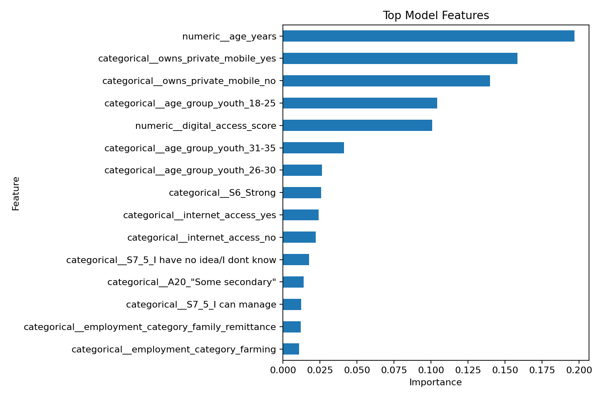

# Predicting Barriers to Financial Inclusion Among Rural Youth in Kenya


This repository is an end-to-end machine learning classification case study using the official FinAccess 2024 Household Survey. The project predicts whether rural youth aged 18-35 are financially excluded and translates the analysis into practical recommendations for policymakers and financial-service providers.

## Background

Kenya is a global leader in mobile money and digital financial services, yet exclusion remains an issue for some rural youth. This project uses survey evidence to examine how demographics, education, employment, and digital access relate to exclusion from formal and informal financial services.

## Problem Statement

Build a reproducible binary classification workflow that predicts financial exclusion among rural Kenyan youth and identifies the most important barriers associated with exclusion.

Target variable:

- `0`: financially included
- `1`: financially excluded

The target is created from the survey field `Overall_Access_fnl`, where records marked `excluded` are treated as financially excluded.

## Dataset

Source: FinAccess Kenya Reports and Datasets  
https://finaccess.knbs.or.ke/reports-and-datasets

Expected local file:

```text
data/raw/2024_Finaccess_Publicdata.xlsx
```

The raw workbook is intentionally ignored by Git because it is large. Download it from the official FinAccess site and place it in `data/raw/` before running the pipeline.

## Repository Structure

```text
.github/workflows/        CI configuration
data/raw/                 Local raw survey files, ignored by Git
data/processed/           Reproducible processed outputs
docs/                     Methodology and project notes
models/                   Saved model pipeline artifacts
notebooks/                Guided case-study notebooks
reports/figures/          Generated visualizations
reports/tables/           Data dictionaries, metrics, and metadata
src/                      Reusable Python modules
tests/                    Pytest suite
```

## Installation

```bash
python -m venv .venv
.venv\Scripts\activate
python -m pip install -r requirements.txt
```

## Usage

Train and compare models on a reproducible sample:

```bash
python -m src.train --sample-size 2000
```

Run against the full workbook:

```bash
python -m src.train --sample-size 0
```

Run tests:

```bash
pytest
```

## How To Run The Model

1. Install the dependencies listed in `requirements.txt`.
2. Download `2024_Finaccess_Publicdata.xlsx` from the official FinAccess site and place it in `data/raw/`.
3. Run the training pipeline:

```bash
python -m src.train --sample-size 2000
```

4. Review the saved outputs:

- `models/best_model.joblib`
- `reports/tables/model_comparison.csv`
- `reports/tables/feature_importance.csv`
- `reports/figures/feature_importance.png`

5. Load the saved model for prediction from Python:

```python
from src.predict import predict_exclusion

profile = {
    "county": "Kisumu",
    "Sex": "Female",
    "Education": "Secondary",
    "A20": "Secondary completed",
    "age_years": 24,
    "age_group_youth": "18-25",
    "employment_category": "self_employment",
    "internet_access": "yes",
    "owns_private_mobile": "yes",
    "S6": "Strong",
    "S7_5": "I can manage",
    "digital_access_score": 3,
}

prediction = predict_exclusion(profile)
print(prediction)
```

The model returns whether the profile is predicted to be financially excluded and the estimated exclusion probability.

## Machine Learning Workflow

1. Inspect the FinAccess workbook and variable metadata.
2. Filter to rural respondents aged 18-35.
3. Create the binary financial-exclusion target.
4. Engineer interpretable demographic, employment, and digital-access features.
5. Prevent leakage by excluding direct financial-service access indicators from predictors.
6. Train baseline, Logistic Regression, Decision Tree, Random Forest, and tuned Random Forest models.
7. Compare models using accuracy, precision, recall, F1, and ROC AUC.
8. Save the best model pipeline and reproducible report tables.

## Results

Generated results are saved to:

- `reports/tables/model_comparison.csv`
- `reports/tables/training_metadata.json`
- `reports/tables/feature_importance.csv`
- `reports/figures/feature_importance.png`
- `models/best_model.joblib`

The current committed results were generated from a reproducible 2,000-row sample of the public workbook. After filtering to rural youth aged 18-35, the sample contained 464 respondents: 401 financially included and 63 financially excluded.

| Model | Accuracy | Precision | Recall | F1 Score | ROC AUC |
|---|---:|---:|---:|---:|---:|
| Tuned Random Forest | 0.892 | 0.571 | 0.923 | 0.706 | 0.949 |
| Logistic Regression | 0.892 | 0.579 | 0.846 | 0.688 | 0.938 |
| Decision Tree | 0.839 | 0.464 | 1.000 | 0.634 | 0.928 |
| Random Forest | 0.849 | 0.480 | 0.923 | 0.632 | 0.949 |
| Dummy Baseline | 0.860 | 0.000 | 0.000 | 0.000 | 0.500 |

The tuned Random Forest produced the strongest F1 score in the sample run. F1 is emphasized because the positive class is financial exclusion, and recall matters when the goal is to identify youth who may need targeted support.

## Visualizations

### Feature Importance

The feature-importance chart shows which model inputs contributed most to predicting financial exclusion in the sample run.



The most influential predictors were age, private mobile-phone ownership, digital access score, youth age group, mobile network quality, internet access, app-use confidence, and employment category. These patterns suggest that digital access and life-stage differences are central to understanding exclusion among rural youth.

Additional exploratory visualizations are included in the notebooks:

- `notebooks/03_exploratory_data_analysis.ipynb`: education, digital access, and exclusion-rate charts
- `notebooks/05_model_development.ipynb`: model training and comparison workflow
- `notebooks/06_model_evaluation.ipynb`: model evaluation summary

Because the raw dataset is not committed, users should regenerate metrics and notebook outputs locally after placing the official workbook in `data/raw/`.

## Policy Recommendations

The recommendations below are based on the current sample run and should be validated again when the full workbook is processed.

### Government and Regulators

- Expand rural digital infrastructure where mobile network quality and internet access remain weak.
- Pair financial-inclusion programs with youth digital-literacy training, especially practical use of mobile apps, USSD, and digital public services.
- Use county-level targeting to prioritize rural areas where exclusion rates remain high after full-data analysis.

### Commercial Banks and Microfinance Institutions

- Design low-cost youth accounts with simple onboarding, low minimum balances, and mobile-first access.
- Reduce documentation and transaction-cost barriers for rural youth while maintaining responsible KYC controls.
- Build assisted digital onboarding through agents, schools, youth centers, and local administration offices.

### SACCOs and Community Finance Providers

- Offer youth savings groups and entry-level SACCO products linked to financial education.
- Use community-based outreach to reach youth with limited private phone access or low confidence using financial apps.
- Develop products for irregular-income youth, including farmers, casual workers, and self-employed respondents.

### Mobile Money and Digital Finance Providers

- Improve rural agent reliability, network coverage, and customer support for young users.
- Provide safer, clearer app and USSD experiences for users with low digital confidence.
- Support affordable feature-phone pathways so inclusion does not depend only on smartphone ownership.

### Development Organizations

- Fund interventions that combine digital access, financial literacy, and livelihood support rather than treating exclusion as only a banking problem.
- Monitor model performance across gender, education, county, and employment groups to reduce the risk of unequal targeting errors.
- Evaluate programs with follow-up data so future work can move from association toward stronger causal evidence.

## Limitations

The analysis is based on cross-sectional survey data, so it identifies associations rather than causal effects. Results also depend on survey measurement quality, missing data patterns, and the representativeness of rural youth responses in the public dataset.

## References

- FinAccess Kenya Reports and Datasets
- Central Bank of Kenya
- Kenya National Bureau of Statistics
- Financial Sector Deepening Kenya
- Microsoft ML-For-Beginners
- Scikit-learn, Pandas, NumPy, and Matplotlib documentation

## License

MIT License

## Author

JoelKy-coder
